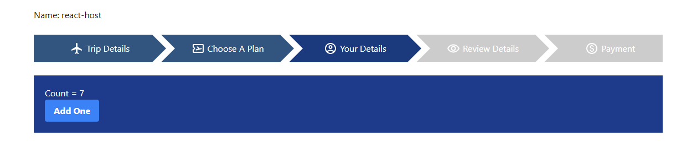

# Micro-Frontend-React

A monorepo to showcase micro frontend architecture between 2 different libraries (React, SolidJs)

<p align="center"> 
    </img>
</p>

## Installation

1. Clone/download repo
2. Install yarn

## Usage

1. Open the micro-frontend-react folder in VSCode
2. Open a new terminal in vscode and copy paste the following codes and press enter
   - ```bash
     cd remote-react
     yarn install
     yarn start
     ```
3. Open another terminal and copy paste the following codes
   - ```bash
     cd remote-solidjs
     yarn install
     yarn start
     ```
4. Open another terminal and copy paste the following codes
   - ```bash
     cd host-react
     yarn install
     yarn start
     ```
5. Go to `http://localhost:8080/` on browser
